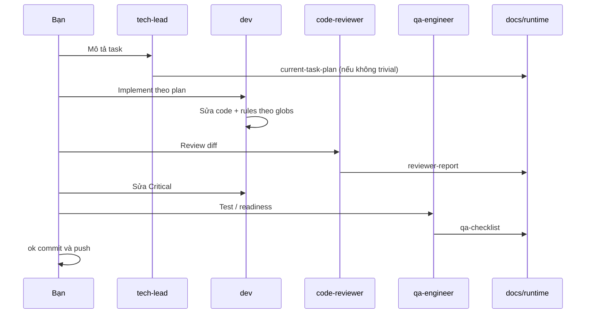

# Mẫu quy trình: một task từ chat → merge (mô phỏng)

> **Mục đích:** Toàn cảnh một lượt làm việc với Agent Team — ai làm gì, chat ra sao, **file nào ghi gì** (nếu làm thật).
> **Lưu ý:** Đây là **kịch bản mẫu**, không ghi đè `docs/runtime/*` trong repo. Dùng để đọc trước khi chạy task thật.

**Task giả định (monorepo kiểu project-name):**
Thêm lọc mission theo **status** trên `project-name-client` (Nuxt 3 + Bootstrap), API Nest `project-name-api` hỗ trợ query `?status=`.

---

## 0. Trước khi bắt đầu — đọc gì?

| Loại | File | Có ghi trong task này? |
|------|------|-------------------------|
| Workflow | `AGENTS.md` | Agent đọc; **không sửa** |
| Trạng thái tổng | `docs/PROJECT-STATUS.md` | Đọc/cập nhật khi phase đổi mode |
| Chuẩn dài hạn | `docs/kb/coding-standards.md` | Đọc; chỉ sửa nếu chốt quy ước mới sau task |
| Bối cảnh dự án | `docs/memory/project-memory.md` | Đọc (vd. Nuxt client, Nest API) |
| Quyết định cũ | `docs/memory/decisions.md` | Đọc |
| Handoff tạm | `docs/runtime/*` | **Sẽ ghi** khi chạy thật (bên dưới là nội dung mẫu) |
| Skill (tùy chọn) | `@team-workflow`, `@pre-propose-commit` | Không ghi file; chỉ hướng dẫn bước |



---

## 1. Tech Lead — chốt scope

### Chat (bạn → agent)

```text
@agents/tech-lead
Task: Thêm filter mission theo status trên project-name-client.
API project-name-api cho phép query ?status=. Đọc docs/memory và docs/kb nếu có.
Task không trivial — cập nhật docs/runtime/current-task-plan.md.
```

### Chat (agent → bạn) — tóm tắt

- **In scope:** dropdown status trên trang mission; `GET /missions?status=`; giữ pagination hiện tại.
- **Out of scope:** đổi schema DB; project-name-admin.
- **Acceptance:** chọn status → list đúng; bỏ lọc → như cũ; lỗi API hiển thị rõ.
- **Tasks:** (1) Nest query + validate (2) service (3) Vue UI + refetch (4) test API.
- **Rủi ro:** shape response pagination đã cố định trong memory chưa?

### File ghi (khi chạy thật): `docs/runtime/current-task-plan.md`

```markdown
## Meta
| Field | Value |
|-------|--------|
| Task ID | TASK-042 |
| Task title | Filter mission list by status |
| Related epic | (optional) |
| Related epic plan | |
| Status | in-progress |

## Goal
Filter mission list by status on project-name-client.

## In scope
- UI dropdown; API query param status (enum).

## Out of scope
- Admin portal; DB migration.

## Acceptance criteria
- [ ] Dropdown 3+ status; list updates
- [ ] No status = default list
- [ ] Invalid status → 400 from API

## Implementation breakdown
1. backend-dev: controller + DTO
2. frontend-dev: pages/mission + FormSelect
3. Tests: service + manual smoke
```

> Rewrite toàn bộ file khi sang Task khác — không append TASK tiếp theo dưới TASK cũ.
> Project Mode (`ACTIVE`/`DONE`/`MAINTAIN`) chỉ nằm ở `docs/PROJECT-STATUS.md`.

| Không ghi vào | Vì sao |
|---------------|--------|
| `docs/kb/*` | Chưa chốt chuẩn mới |
| `decisions.md` | Chưa đổi contract (chỉ thêm query optional) |

---

## 2. Backend Dev — Nest API

### Chat (bạn → agent)

```text
@agents/backend-dev
Implement phần API theo current-task-plan.md. Chỉ project-name-api.
```

### Rules IDE tự bật (ví dụ)

| File mở | Rule |
|---------|------|
| `*.controller.ts` | `stack-examples-nestjs-typescript.mdc` |
| Luôn | `karpathy-guidelines.mdc` |

### Kết quả (code thật, không phải doc)

- `client-mission.controller.ts`: `@Query('status')` + validate enum.
- Không đổi envelope JSON list hiện có.

### File runtime

| File | Ghi? |
|------|------|
| `current-task-plan.md` | Có thể tick task 1 done |
| `reviewer-report.md` | Chưa |

---

## 3. Frontend Dev — Nuxt client

### Chat

```text
@agents/frontend-dev
Implement UI filter theo plan. Dùng component form có sẵn. project-name-client only.
```

### Rules IDE tự bật (ví dụ)

| File mở | Rule |
|---------|------|
| `*.vue` | `stack-examples-nuxt-vue.mdc`, `css-framework-adaptive.mdc` |
| `nuxt.config.ts` | `typescript-and-performance.mdc` |

### Kết quả (code)

- `pages/mission/index.vue`: `FormSelect` + `watch` refetch `$fetch`/`useFetch`.

### File runtime

Chỉ cập nhật plan (task 2 done). Vẫn **chưa** review.

---

## 4. Code Reviewer

### Chat

```text
@agents/code-reviewer
Review toàn bộ diff task filter mission. Ghi docs/runtime/reviewer-report.md.
```

### Chat (agent → bạn) — tóm tắt

| Mức | Ví dụ |
|-----|--------|
| Critical | API không validate `status` → chấp nhận giá trị lạ |
| Warning | `<select>` thiếu accessible name |
| Suggestion | Debounce refetch 300ms |

### File ghi: `docs/runtime/reviewer-report.md`

```markdown
## Verdict
changes-required

## Critical
- [ ] Validate status enum in Nest DTO/pipe

## Warnings
- [ ] Label for status filter (aria-label or <label>)

## Suggestions
- Debounce refetch optional
```

---

## 5. Dev — sửa Critical

### Chat

```text
@agents/backend-dev @agents/frontend-dev
Sửa hết Critical trong reviewer-report.md. Không mở rộng scope.
```

→ Sửa code → có thể **cập nhật** `reviewer-report.md` (tick Critical, đổi verdict `approve-with-notes`).

**Không** ghi `decisions.md` trừ khi đổi contract.

---

## 6. QA Engineer

### Chat

```text
@agents/qa-engineer
Lập test plan và release readiness cho task filter mission.
Ghi docs/runtime/qa-checklist.md.
```

### File ghi: `docs/runtime/qa-checklist.md`

```markdown
## Scope under test
Mission status filter (client + API)

## Tests
- [ ] API: status=valid / invalid / omitted
- [ ] UI: each option; clear filter; error state
- [ ] Regression: pagination unchanged

## Release readiness
- [ ] lint/test project-name-api PASS
- [ ] manual smoke client PASS
- Verdict: ready for merge (no DB migration)
```

### File tùy chọn: `docs/runtime/release-note-draft.md`

```markdown
## User-facing (draft)
- Mission list can be filtered by status.
```

*(Không thay commit message chính thức.)*

---

## 7. Pre-propose commit (skill)

### Chat

```text
@pre-propose-commit
Chuẩn bị đề xuất commit cho diff hiện tại.
```

### Báo cáo chat (mẫu — **không** lưu file)

```text
## Tóm tắt thay đổi
- project-name-api: query status on mission list
- project-name-client: status dropdown + refetch

## Kiểm tra đã chạy
- cd project-name-api && npm run lint && npm test — PASS
- cd project-name-client && npm run lint — PASS

## Rủi ro còn lại
- Chưa E2E Playwright
```

---

## 8. Bạn — done & Git

| Bước | Ai | Hành động |
|------|-----|-----------|
| 1 | Bạn | “Done scope filter mission” |
| 2 | Bạn | `ok commit và push` |
| 3 | Agent | `git commit` + `git push` (theo Git Policy) |

**Agent không** commit trước cụm trên.

---

## 9. Sau merge — promote (lâu dài)

| Tình huống | Ghi đâu |
|------------|---------|
| Chỉ thêm query optional, không đổi JSON | Thường **không** cần `decisions.md` |
| Chốt: “Mọi list filter dùng query enum + validate pipe” | `docs/memory/decisions.md` + có thể 1 đoạn `coding-standards.md` |
| Ghi nhớ monorepo paths | `project-memory.md` |
| Xóa handoff task | Reset / archive `docs/runtime/*` |

| File | Sau task |
|------|----------|
| `docs/runtime/*` | Xóa nội dung hoặc archive — **không** là lịch sử chính |
| `docs/kb/*` | Giữ; chỉ sửa khi chuẩn team đổi |

---

## 10. Task trivial — rút gọn

Ví dụ: sửa typo trong README.

| Bỏ qua | Giữ |
|--------|-----|
| Epic, `current-task-plan`, QA đầy đủ | Review nhanh nếu có code |
| `qa-checklist` dài | `pre-propose-commit` nếu có script |

Xem thêm [`sample-planning-scenarios.md`](sample-planning-scenarios.md).

---

## Bảng tổng hợp: file nào, khi nào?

| File | Ai thường ghi | Nội dung điển hình |
|------|----------------|-------------------|
| `docs/PROJECT-STATUS.md` | tech-lead / bạn | Mode tổng ACTIVE / DONE / MAINTAIN, current phase/epic/task |
| `docs/plan/EPIC-*.md` | tech-lead | Canonical Epic HOW (khi scope Epic-sized) |
| `docs/runtime/current-task-plan.md` | tech-lead | Đúng một Task: goal, scope, acceptance, breakdown |
| `docs/runtime/reviewer-report.md` | code-reviewer | Critical / Warnings / Suggestions, verdict |
| `docs/runtime/qa-checklist.md` | qa-engineer | Test plan, readiness |
| `docs/runtime/release-note-draft.md` | bất kỳ (tùy) | Nháp release cho người đọc |
| `docs/memory/decisions.md` | tech-lead / bạn | Quyết định **đã chốt**, có impact |
| `docs/memory/project-memory.md` | bạn / lead | Context ngắn, convention đang thử |
| `docs/kb/coding-standards.md` | sau khi chốt chuẩn | Policy lâu dài |
| Chat pre-propose | agent | Tóm tắt + lint/test — **không** lưu file |
| Git commit message | agent (khi bạn duyệt) | Mô tả thay đổi — không nằm trong `docs/runtime` |

---

## Prompt mẫu: delivery audit read-only

```text
Review tiến độ so docs/plan/ — READ ONLY.
Đọc: PROJECT-STATUS.md, docs/plan/EPIC-*.md (và draft-* nếu có), docs/design/**,
docs/memory/*.md, docs/runtime/*.md, git log -30,
git diff <baseline>..HEAD --stat.
Output:
1) phase | epic/plan | đã làm | còn thiếu | file liên quan
2) rủi ro / lệch thiết kế
3) 3–5 việc ưu tiên tiếp theo
Không sửa code, không chạy build.
```

Role gợi ý: `@agents/delivery-auditor`. Xem thêm [`sample-close-phase.md`](sample-close-phase.md) và [`sample-planning-scenarios.md`](sample-planning-scenarios.md).

---

## Tham chiếu

- Workflow chính thức: [`AGENTS.md`](../AGENTS.md)
- Phân tầng tài liệu: [`docs/README.md`](../README.md)
- Skill pipeline: [`.cursor/skills/team-workflow/SKILL.md`](../.cursor/skills/team-workflow/SKILL.md)
